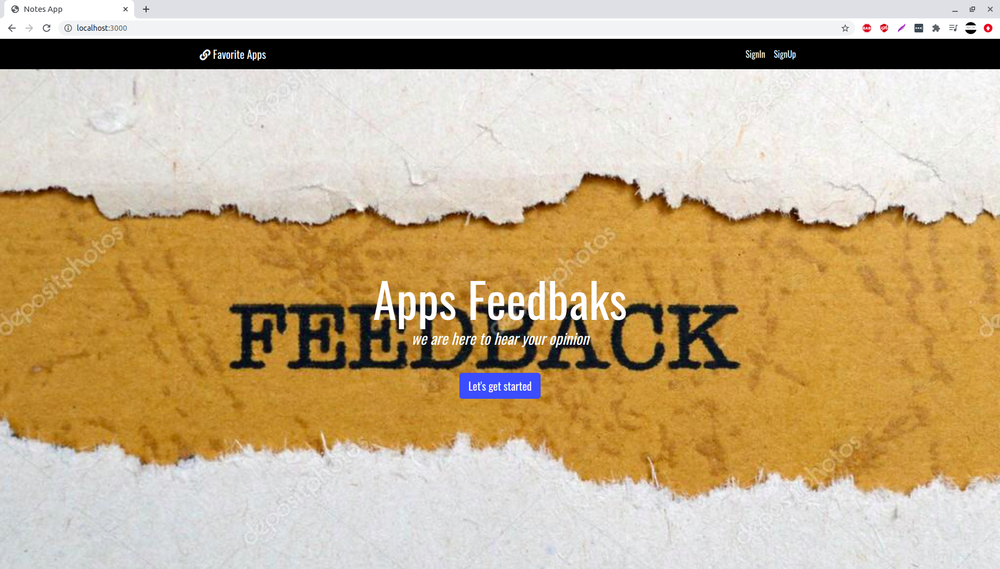
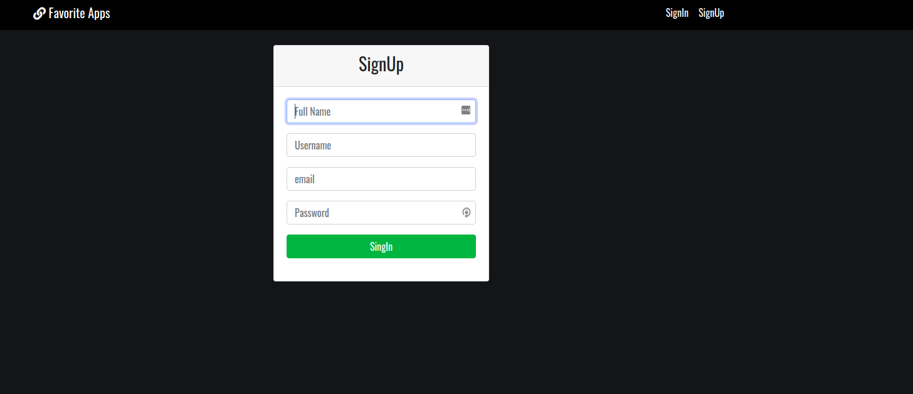
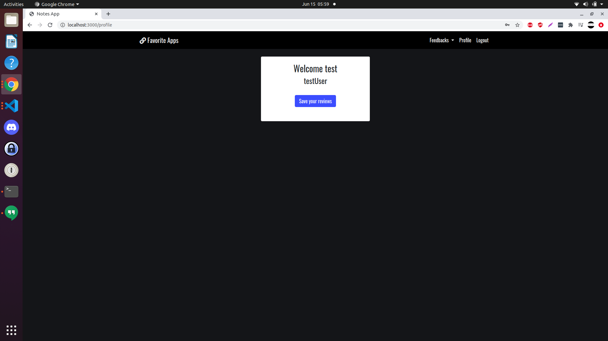
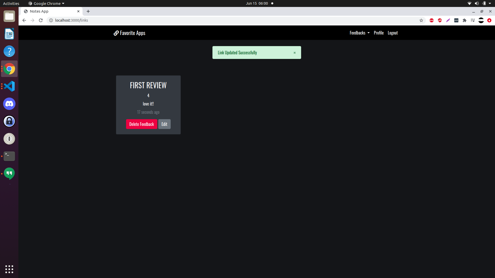
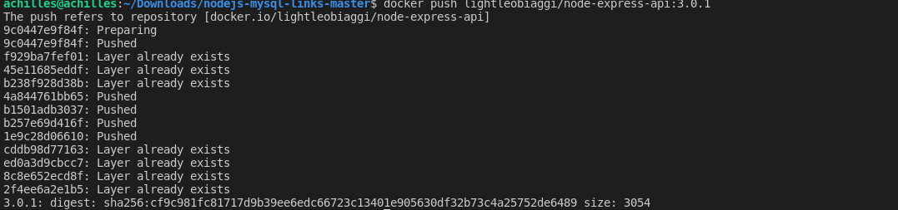
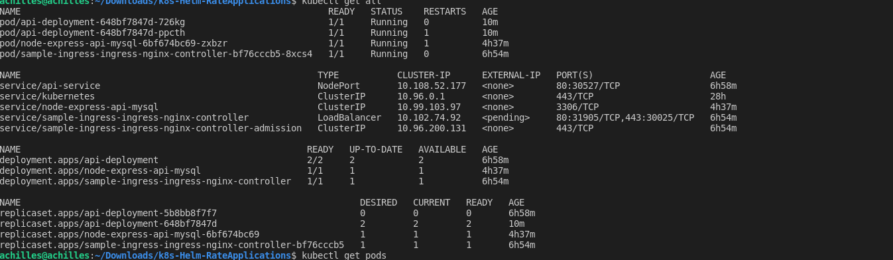
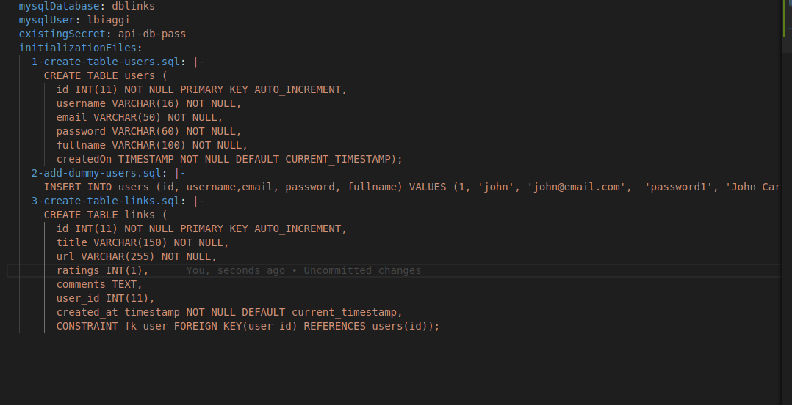
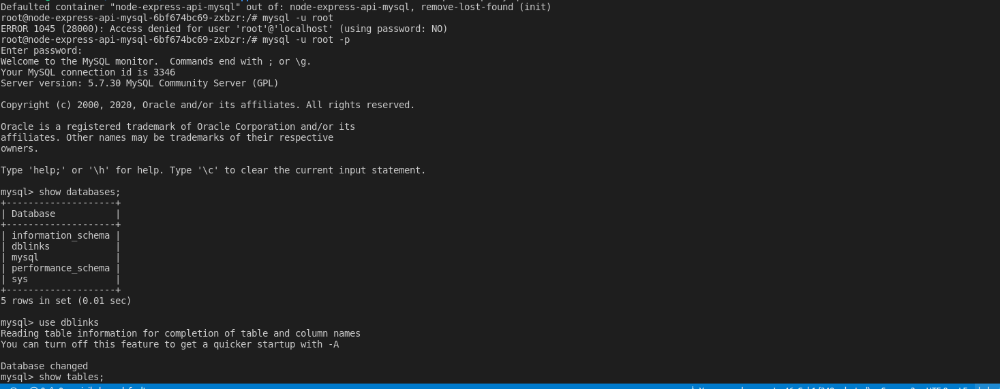
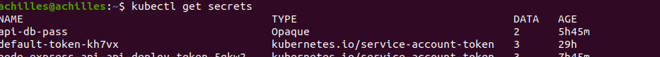

# Application

App is a Multi Page Application using Nodejs and Mysql. The purpose of this web application to provide rating for apps for used to evalute the applications and provide feed backs and comments
 
 to use this app you need to signup then add the feedbacks for each links

 below are screenshots of the the app


 this is the first page
 this is the signup page
 this is the first page
 this is an add a review page
 review example

## Installation
```
the application can be run locally use the folo
mysql -u MYUSR "-pMYPASSWORD" < ./database/db.sql # create database
npm i
npm run build
npm start
```

## dockerized public image in repo
the image is build can can be found at 
[rate-app-repo](https://hub.docker.com/repository/docker/lightleobiaggi/node-express-api) 

screenshot of building the image which will be used in the charts


# kubernetes
for kuberneted I initialize it with following
- 2 pods for application
- ingress(had issues with it no time to debug)
- MySQL database from helm chart with init scripts and secrets bootstrapped

screenshots
- 
-  database bootstrapped with init script and dbs
-  database bootstrapped with init script and dbs
-  secrets added for db


## Future improvements

1. [ ] Use Tidb cluster for HA and resiliency instead of current mysql [TiDB Operator](https://github.com/pingcap/tidb-operator) 
1. [ ] fimprove loadbalancing and retrial logic (wish had time to do that)
1. [ ] Add Prometheus monitoring to deployment for sla/slo
1. [ ] user cannot add more than one review per app
1. [ ] List of app saved in db and populated dynamically with more validation
1. [ ] Add rating star view instead of numberic

## Tools

- Nodejs
- Mysql
- Babel
- Docker
- Helm3
- Kubectl
- Minikube


